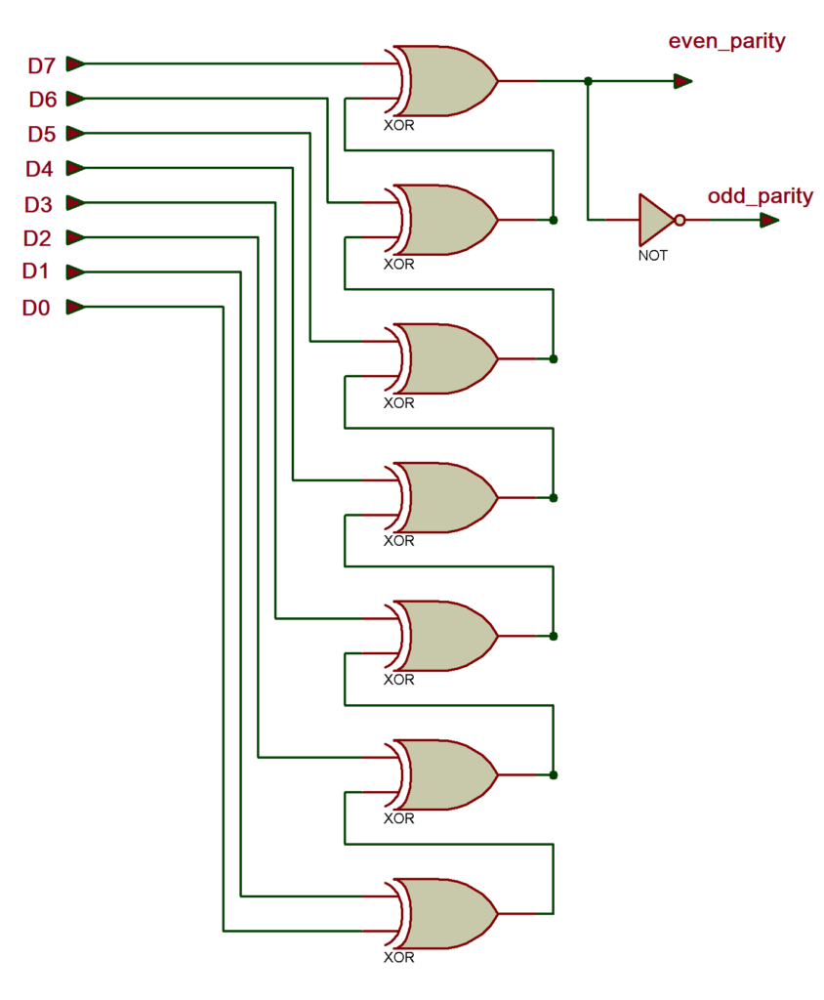
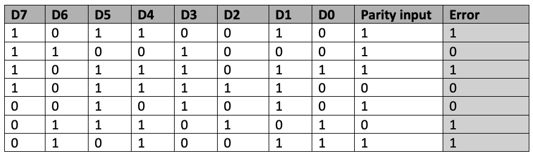
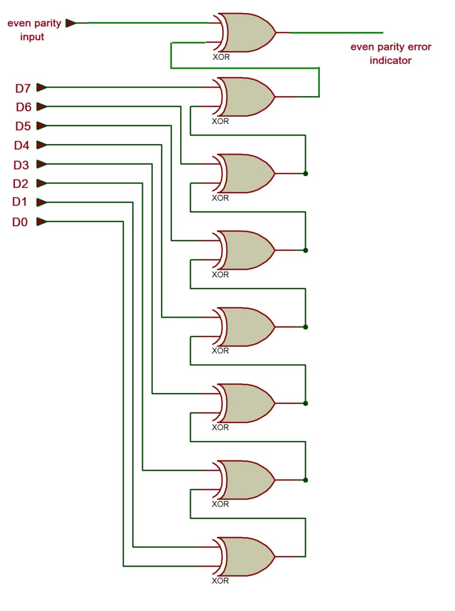
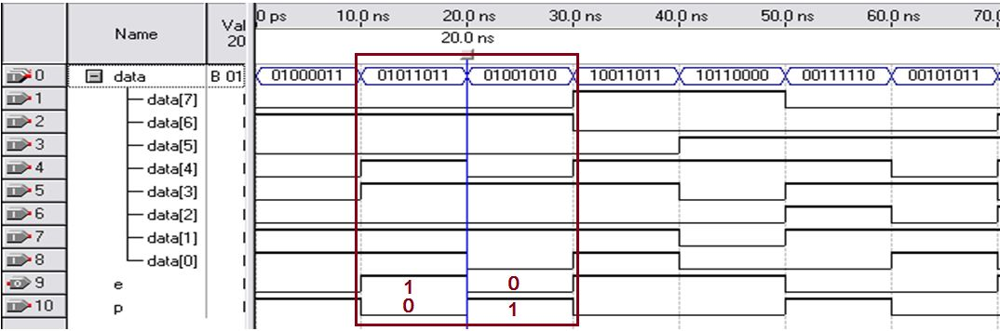

# design-and-simulate-8-bit-parity-generator-using-verilog

# AIM:
TO design and simulate 8 bit parity genetor using verilog.

# INTRODUCTION:
The parity generating technique is one of the most widely used error detection techniques for the data transmission. In digital systems, when binary data is transmitted and processed, data may be subjected to noise so that such noise can alter 0s (of data bits) to 1s and 1s to 0s.

Hence, a Parity Bit is added to the word containing data in order to make number of 1s either even or odd. The message containing the data bits along with parity bit is transmitted from transmitter to the receiver.


# Parity Generator and Checker
A Parity Generator is a combinational logic circuit that generates the parity bit in the transmitter. On the other hand, a circuit that checks the parity in the receiver is called Parity Checker. 

# LOGIC DIAGRAM:


# program:
```
# developed by:MAthiyazhagan.A
# reference no: 22005215

library ieee;
use ieee.std_logic_1164.all;
entity parity_chk is
      port( data:in bit_vector(7 downto 0);
                  p: in bit;
                  e: out bit);
end parity_chk;
architecture parity_arch of parity_chk is
signal temp : bit_vector(6 downto 0);
  begin
    temp(0)<=data(0) xor data(1);
    temp(1)<=temp(0) xor data(2);
    temp(2)<=temp(1) xor data(3);
    temp(3)<=temp(2) xor data(4);
    temp(4)<=temp(3) xor data(5);
    temp(5)<=temp(4) xor data(6);
    temp(6) <= temp(5) xor data(7);
    e <= p xor temp(6);
end parity_arch;
```
# TRUTH TABLE:


# RTL DIAGRAM:


# TIMING DIAGRAM:




# RESULT:
Thus the required design and simulate 8 bit parity using verilog has executed
